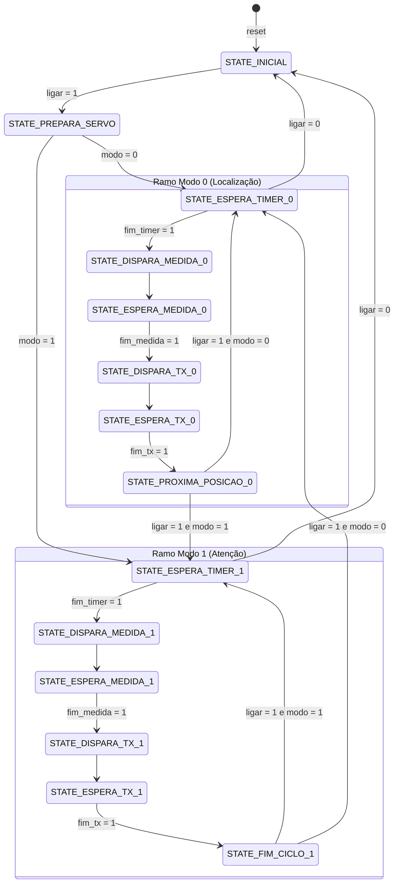

# Plan: Sistema de Sonar Modificado - Planejamento EXP6

## Goal
Projetar e planejar a arquitetura completa do **Sistema de Sonar Modificado** para a bancada do Laboratório Digital (FPGA Cyclone V DE0-CV) e simulação ModelSim/Icarus Verilog, cumprindo rigorosamente as especificações do Roteiro e das Dicas de Projeto da EXP6 e aderindo aos padrões synthesizable Verilog-2001 estabelecidos em `docs/llm/software-engineering-rules-verilog.md`.

O sistema mantém a funcionalidade base da EXP5 (varredura angular de 20° a 160°, medição ultrassônica com HC-SR04, transmissão serial de pacotes `AAA,DDD#` a 115200 bauds 7E1 a cada 2 segundos) e adiciona:
1. Recepção serial assíncrona (7E1 a 115200 bauds) via pino `entrada_serial` (`GPIO_0_D3`).
2. Controle de modos operacionais por caracteres seriais:
   - Caractere `'a'` (`7'h61`): entra no **Modo de Atenção** (`modo = 1`), congelando o movimento angular do servomotor mas mantendo medições e transmissões seriais a cada 2 s na posição atual.
   - Caractere `'v'` (`7'h76`): retorna ao **Modo de Localização** (`modo = 0`), retomando o avanço angular a partir da posição onde foi interrompido.
   - Quaisquer outros caracteres são ignorados.
3. Arquitetura estrita de Unidade de Controle (UC) bifurcada em sequências de estados independentes para cada modo, sem qualquer lógica combinatória inibindo sinais de controle no Fluxo de Dados (FD).
4. Multiplexação 4x1 dos 6 displays de 7 segmentos (`HEX5..HEX0`) e mapeamento dos 10 LEDs (`LEDR[9..0]`) para depuração em tempo real de múltiplos subsistemas.

---

## Approach

### 1. Hierarquia Estrutural dos Módulos

Adota-se a estrutura em dois níveis de top-level para isolamento entre núcleo sintetizável e pinagem física:
- `sonar.v`: Núcleo estrutural padronizado (DUT para simulação limpa conforme Figura 1 da apostila).
- `exp6_sonar.v`: Top-level para a placa DE0-CV (Figura 4 da apostila), instanciando `sonar.v`, sincronizadores modulares de 2 flip-flops, multiplexador 4x1 de 24 bits para os displays `HEX5..HEX0` e mapeamento de LEDs `LEDR[9..0]`.

```
exp6_sonar (Top FPGA DE0-CV)
├── sincronizador (u_sync_reset, u_sync_ligar, u_sync_echo, u_sync_rx)
├── sonar (DUT / Núcleo do Sistema)
│   ├── sonar_uc (FSM com bifurcação de estados Modo 0 vs Modo 1)
│   └── sonar_fd (Fluxo de Dados Estrutural)
│       ├── contador_m [M=8, N=3] (Posição do servomotor 000 a 111)
│       ├── rom_angulos_8x24 (Posição [2:0] -> Ângulo ASCII [23:0])
│       ├── controle_servo_8 (Geração PWM 50 MHz para 8 ângulos)
│       ├── interface_hcsr04 (HC-SR04 com watchdog timeout de 1,0 s)
│       │   ├── interface_hcsr04_uc
│       │   └── interface_hcsr04_fd (contador_cm, gerador_pulso, registrador_n)
│       ├── transmissor_sonar (Transmissão serial de 8 caracteres ASCII "AAA,DDD#")
│       │   ├── transmissor_sonar_uc
│       │   ├── transmissor_sonar_fd (MUX ASCII 8x1 e contador de caracteres)
│       │   └── tx_serial_7E1 (Transmissor serial 115200 bauds 7E1)
│       │       ├── tx_serial_7E1_uc
│       │       ├── tx_serial_7E1_fd
│       │       └── contador_m (Gerador de tick de baud rate M=434)
│       ├── rx_serial_7E1 (Receptor serial assíncrono 115200 bauds 7E1 refatorado)
│       │   ├── rx_serial_uc
│       │   ├── rx_serial_7E1_fd
│       │   │   ├── deslocador_n [N=11]
│       │   │   ├── contador_m [M=11, N=4]
│       │   │   └── registrador_n [N=8]
│       │   └── contador_m (Gerador de tick de amostragem no meio do bit M=434)
│       ├── registrador_modo (Registrador do modo de operação com detecção de 'a' e 'v')
│       └── contador_m [M=100M / 10k] (Temporizador de repouso 2,0 s / 200 µs)
├── multiplexador_displays (MUX 4x1 de 24 bits controlado por sel_mux)
└── 6x hexa7seg (Decodificadores BCD/Hex para HEX0..HEX5)
```

---

### 2. Adequação do Receptor Serial (`rx_serial_7E1`) às Regras de Engenharia

Os arquivos fornecidos na pasta `Planejamento/` contêm violações de linting e padrões obsoletos. Serão refatorados da seguinte forma:

#### A) `rx_serial_uc.v`
- Inclusão das diretivas `` `default_nettype none `` no topo e `` `default_nettype wire `` no final.
- Substituição de `parameter` por `localparam [3:0]` para os estados:
  `STATE_INICIAL = 4'd0`, `STATE_PREPARACAO = 4'd2`, `STATE_ESPERA = 4'd3`, `STATE_RECEPCAO = 4'd7`, `STATE_REGISTRAR = 4'd9`, `STATE_FINAL_RX = 4'd15`.
- Separação estrita em processo sequencial (`always @(posedge clock or posedge reset)`) com não-bloqueante (`<=`) e processo combinacional (`always @*`) com bloqueante (`=`).
- Idioma de atribuição padrão no topo do bloco combinacional para eliminação completa de latches.

#### B) `rx_serial_7E1_fd.v`
- Inclusão das diretivas `` `default_nettype none `` e `` `default_nettype wire ``.
- Ajuste nos nomes de instâncias para seguir prefixo `u_`: `u_deslocador`, `u_contador`, `u_registrador`.
- Conexões ANSI C e bindings explícitos `.port(signal)`.

#### C) `rx_serial_7E1.v`
- Inclusão das diretivas `` `default_nettype none `` e `` `default_nettype wire ``.
- Prefixos `u_fd`, `u_uc`, `u_tick`.
- Instanciação de `contador_m` com `.zera_as(1'b0)`, `.zera_s(s_zera_tick)`, `.conta(1'b1)`, `.meio(s_tick)`.

#### D) `rx_serial_tb.v`
- Eliminação completa de construções SystemVerilog (`logic`, `typedef struct`, `foreach`, literais de tempo `20ns`).
- Conversão para Verilog-2001 puro compatível com Icarus Verilog, ModelSim e Quartus Prime:
  - Sinais declarados como `reg` e `wire`.
  - Array de casos de teste em memória indexada ou sequência determinística via `task UART_WRITE_BYTE`.
  - Instanciação com binding nomeado e prefixo `uut`.

---

### 3. Reutilização de Módulos da EXP5/Relatório

Serão reutilizados integralmente de `Laboratórios/EXP5/Relatório/`:
- `contador_m.v`, `deslocador_n.v`, `registrador_n.v`, `hexa7seg.v`
- `sincronizador.v` (módulo de 2 FFs com largura parametrizável)
- `controle_servo_8.v` (PWM para 8 posições de 20° a 160°)
- `rom_angulos_8x24.v` (mapeamento ROM de ângulos em ASCII)
- `contador_bcd_3digitos.v`, `contador_cm.v`, `contador_cm_fd.v`, `contador_cm_uc.v`, `gerador_pulso.v`
- `interface_hcsr04.v`, `interface_hcsr04_fd.v`, `interface_hcsr04_uc.v` (com suporte a timeout de perda de eco)
- `tx_serial_7E1.v`, `tx_serial_7E1_fd.v`, `tx_serial_7E1_uc.v`
- `transmissor_sonar.v`, `transmissor_sonar_fd.v`, `transmissor_sonar_uc.v`

---

### 4. Arquitetura da Unidade de Controle (`sonar_uc.v`) com Bifurcação de Modos

Para atender à **Restrição de Projeto B** (separação estrita de sequências de estados sem lógica combinatória sobre sinais de controle no FD):

#### Diagrama de Estados e Bifurcação



#### Codificação dos Estados (`localparam [3:0]`):
- `STATE_INICIAL`             = `4'b0000` (0)
- `STATE_PREPARA_SERVO`       = `4'b0001` (1)
- **Modo 0 (Localização / Varredura)**:
  - `STATE_ESPERA_TIMER_0`    = `4'b0010` (2)
  - `STATE_DISPARA_MEDIDA_0`  = `4'b0011` (3)
  - `STATE_ESPERA_MEDIDA_0`   = `4'b0100` (4)
  - `STATE_DISPARA_TX_0`      = `4'b0101` (5)
  - `STATE_ESPERA_TX_0`       = `4'b0110` (6)
  - `STATE_PROXIMA_POSICAO_0` = `4'b0111` (7) [Gera `conta_posicao = 1` e `fim_posicao = 1`]
- **Modo 1 (Atenção / Posição Fixa)**:
  - `STATE_ESPERA_TIMER_1`    = `4'b1010` (A)
  - `STATE_DISPARA_MEDIDA_1`  = `4'b1011` (B)
  - `STATE_ESPERA_MEDIDA_1`   = `4'b1100` (C)
  - `STATE_DISPARA_TX_1`      = `4'b1101` (D)
  - `STATE_ESPERA_TX_1`       = `4'b1110` (E)
  - `STATE_FIM_CICLO_1`       = `4'b1111` (F) [`conta_posicao = 0`, `fim_posicao = 0`]

#### Tabela de Saídas de Controle por Estado (Máquina de Moore):

| Estado | `zera_posicao` | `conta_posicao` | `zera_timer` | `conta_timer` | `medir` | `transmitir` | `fim_posicao` | `db_estado` |
|---|:---:|:---:|:---:|:---:|:---:|:---:|:---:|:---:|
| `STATE_INICIAL` (0) | 0 | 0 | 1 | 0 | 0 | 0 | 0 | 4'h0 |
| `STATE_PREPARA_SERVO` (1) | 0 | 0 | 1 | 0 | 0 | 0 | 0 | 4'h1 |
| `STATE_ESPERA_TIMER_0` (2) | 0 | 0 | 0 | 1 | 0 | 0 | 0 | 4'h2 |
| `STATE_DISPARA_MEDIDA_0` (3) | 0 | 0 | 0 | 0 | 1 | 0 | 0 | 4'h3 |
| `STATE_ESPERA_MEDIDA_0` (4) | 0 | 0 | 0 | 0 | 0 | 0 | 0 | 4'h4 |
| `STATE_DISPARA_TX_0` (5) | 0 | 0 | 0 | 0 | 0 | 1 | 0 | 4'h5 |
| `STATE_ESPERA_TX_0` (6) | 0 | 0 | 0 | 0 | 0 | 0 | 0 | 4'h6 |
| `STATE_PROXIMA_POSICAO_0` (7) | 0 | **1** | 1 | 0 | 0 | 0 | **1** | 4'h7 |
| `STATE_ESPERA_TIMER_1` (A) | 0 | 0 | 0 | 1 | 0 | 0 | 0 | 4'hA |
| `STATE_DISPARA_MEDIDA_1` (B) | 0 | 0 | 0 | 0 | 1 | 0 | 0 | 4'hB |
| `STATE_ESPERA_MEDIDA_1` (C) | 0 | 0 | 0 | 0 | 0 | 0 | 0 | 4'hC |
| `STATE_DISPARA_TX_1` (D) | 0 | 0 | 0 | 0 | 0 | 1 | 0 | 4'hD |
| `STATE_ESPERA_TX_1` (E) | 0 | 0 | 0 | 0 | 0 | 0 | 0 | 4'hE |
| `STATE_FIM_CICLO_1` (F) | 0 | **0** | 1 | 0 | 0 | 0 | **0** | 4'hF |

---

### 5. Fluxo de Dados (`sonar_fd.v`) e Registro de Modo

No `sonar_fd.v`, integra-se o módulo `rx_serial_7E1` e o registrador sequencial de modo:
```verilog
localparam [6:0] CHAR_ATENCAO = 7'h61; // 'a'
localparam [6:0] CHAR_VOLTAR  = 7'h76; // 'v'

reg modo_q;

always @(posedge clock or posedge reset) begin
    if (reset) begin
        modo_q <= 1'b0; // Inicia em modo normal (modo = 0)
    end else if (s_rx_pronto && s_rx_paridade_par) begin
        if (s_rx_dados_ascii == CHAR_ATENCAO) begin
            modo_q <= 1'b1; // Modo de atencao (modo = 1)
        end else if (s_rx_dados_ascii == CHAR_VOLTAR) begin
            modo_q <= 1'b0; // Modo normal de localizacao (modo = 0)
        end
        // Demais caracteres nao alteram modo_q
    end
end

assign modo    = modo_q;
assign db_modo = modo_q;
```

---

### 6. Multiplexação de Recursos (Displays e LEDs) no Top-Level (`exp6_sonar.v`)

O seletor `sel_mux[1:0]` (conectado às chaves `SW[3:2]`) controla o barramento de 24 bits exibido nos 6 displays `HEX5..HEX0` (Tabela 1 da apostila):

| `sel_mux` | Subsistema Monitorado | HEX5 | HEX4 | HEX3 | HEX2 | HEX1 | HEX0 |
|:---:|---|:---:|:---:|:---:|:---:|:---:|:---:|
| `00` | Servomotor + HC-SR04 | Posição Servo (`0-7`) | `estado_hcsr04` (`0-F`) | Apagado (`-`) | Distância C (`0-9`) | Distância D (`0-9`) | Distância U (`0-9`) |
| `01` | UART TX + RX | `estado_tx` (`0-F`) | `DADO_TX` Alto (Hex) | `DADO_TX` Baixo (Hex) | `estado_rx` (`0-F`) | `DADO_RX` Alto (Hex) | `DADO_RX` Baixo (Hex) |
| `10` | TX Dados Sonar | `estado_tx_sonar` (`0-F`) | Índice Caractere (`0-7`) | `CHAR_TX` Alto (Hex) | `CHAR_TX` Baixo (Hex) | Apagado (`-`) | Apagado (`-`) |
| `11` | Sonar Top + Ângulo | `estado_sonar` (`0-F`) | `db_modo` (`0` ou `1`) | Apagado (`-`) | Ângulo C (`0-1`) | Ângulo D (`2-6`) | Ângulo U (`0`) |

#### Mapeamento dos 10 LEDs (`LEDR[9:0]`):
- `LEDR[9]`: `db_modo` (0 = Modo Localização, 1 = Modo Atenção)
- `LEDR[8]`: `s_ligar_sinc`
- `LEDR[7:6]`: `sel_mux[1:0]` (Indicação visual da chave de MUX selecionada)
- `LEDR[5]`: `pwm` (Pulso de controle do servo)
- `LEDR[4]`: `saida_serial` (Linha TX)
- `LEDR[3]`: `s_echo_sinc` (Linha Echo)
- `LEDR[2]`: `trigger` (Disparo do sensor)
- `LEDR[1]`: `s_rx_sinc` (Linha RX / atividade)
- `LEDR[0]`: `fim_posicao` (Pulso de avanço de posição)

---

### 7. Designação de Pinos na Placa DE0-CV (Cyclone V 5CEBA4F23C7N)

| Sinal Verilog | Direção | Pino DE0-CV | Pino FPGA | Função |
|---|:---:|---|:---:|---|
| `clock` | Input | `CLOCK_50` | `PIN_M9` | Clock de 50 MHz |
| `reset` | Input | `SW[0]` | `PIN_U13` | Reset geral ativo alto |
| `ligar` | Input | `SW[1]` | `PIN_V13` | Chave de ativação do sonar |
| `sel_mux[0]` | Input | `SW[2]` | `PIN_W12` | Seleção bit 0 MUX de depuração |
| `sel_mux[1]` | Input | `SW[3]` | `PIN_V12` | Seleção bit 1 MUX de depuração |
| `entrada_serial` | Input | `GPIO_0[3]` | `PIN_A13` | Linha RX serial 7E1 (CP2102) |
| `echo` | Input | `GPIO_1[3]` | `PIN_V18` | Sinal Echo do HC-SR04 |
| `trigger` | Output | `GPIO_1[1]` | `PIN_W19` | Disparo Trigger do HC-SR04 |
| `pwm` | Output | `GPIO_0[35]` | `PIN_B15` | Sinal PWM para Servomotor |
| `saida_serial` | Output | `GPIO_0[1]` | `PIN_C16` | Linha TX serial 7E1 (CP2102) |
| `fim_posicao` | Output | `GPIO_1[35]` | `PIN_H15` | Pulso de avanço angular |
| `hex0[6:0]` | Output | `HEX0` | `U21, V21, W22, W21, Y22, Y21, AA22` | Display 7 segmentos HEX0 |
| `hex1[6:0]` | Output | `HEX1` | `AA20, AB20, AA19, AA18, AB18, AA17, U22` | Display 7 segmentos HEX1 |
| `hex2[6:0]` | Output | `HEX2` | `Y19, AB17, AA10, Y14, V14, AB22, AB21` | Display 7 segmentos HEX2 |
| `hex3[6:0]` | Output | `HEX3` | `Y16, W16, Y17, V16, U17, V18, V19` | Display 7 segmentos HEX3 |
| `hex4[6:0]` | Output | `HEX4` | `U20, Y20, V20, U16, U15, Y15, P9` | Display 7 segmentos HEX4 |
| `hex5[6:0]` | Output | `HEX5` | `N9, M8, T14, P14, C1, C2, W19` (HEX5) | Display 7 segmentos HEX5 |
| `ledr[9:0]` | Output | `LEDR[9:0]` | `L1, L2, U1, U2, N1, N2, Y3, W2, AA1, AA2` | 10 LEDs vermelhos |

---

## Vertical Slices & TDD Verification Plan

1. **Fatia 1: Refatoração do Receptor Serial (`rx_serial_7E1`)**
   - Adequar `rx_serial_uc.v`, `rx_serial_7E1_fd.v`, `rx_serial_7E1.v`.
   - Reescrever `rx_serial_tb.v` em Verilog-2001 limpo.
   - Simular com Icarus Verilog: validar recepção com paridade par OK vs corrompida.
2. **Fatia 2: Carga de Módulos Reutilizados da EXP5**
   - Copiar e compilar `sincronizador.v`, `rom_angulos_8x24.v`, `controle_servo_8.v`, `interface_hcsr04` (com timeout), `transmissor_sonar` e `tx_serial_7E1`.
3. **Fatia 3: Implementação da FSM Bifurcada (`sonar_uc.v`) e Datapath (`sonar_fd.v`)**
   - Implementar máquina de Moore com cadeias de estados separadas para Modo 0 e Modo 1.
   - Integrar `rx_serial_7E1` e registrador de detecção de 'a' e 'v' no `sonar_fd.v`.
4. **Fatia 4: Integração do Núcleo (`sonar.v`) e Testbench Abrangente (`sonar_tb.v`)**
   - Testbench com `M_INTERVALO = 10_000` (200 µs):
     - Passo 1: Inicialização em Modo 0 (varredura angular normal, avança posições 0..2).
     - Passo 2: Envio serial do caractere `'a'` via `entrada_serial` $\to$ verificação de transição para `modo = 1`, repetição de medições e pacotes seriais mantendo a mesma posição angular (sem avanço).
     - Passo 3: Envio de caracteres inválidos (ex.: `'x'`, `'A'`, `'1'`) $\to$ verificação de imunidade e permanência em Modo 1.
     - Passo 4: Envio com erro de paridade $\to$ verificação de rejeição.
     - Passo 5: Envio do caractere `'v'` $\to$ retorno ao Modo 0 e continuação da varredura a partir da posição anterior.
5. **Fatia 5: Top-Level (`exp6_sonar.v`) e Simulação (`exp6_sonar_tb.v`)**
   - Conexão do MUX 4x1 de displays e sincronizadores de 2 FFs para `reset`, `ligar`, `echo` e `entrada_serial`.
   - Validação da comutação de `sel_mux` nos displays.
6. **Fatia 6: Quality Gate e Linting**
   - Executar `python scripts/lint_verilog.py` no diretório do projeto garantindo status **PASS (0 errors)**.

---

## Risks and Mitigation

- **Comportamento Assíncrono da Entrada Serial**: Chegada de bytes no meio de uma medição ou transmissão.
  *Mitigação*: O receptor serial opera independentemente no FD e atualiza o registrador `modo_q` assim que `s_rx_pronto && s_rx_paridade_par` são ativados. A FSM da UC lê o sinal estável `modo` nas decisões de transição entre ciclos.
- **Duração da Simulação**: Temporizador real de 2,0 s tornaria testbenches inviáveis.
  *Mitigação*: Uso do parâmetro `M_INTERVALO = 10_000` nos testbenches para simulação em milissegundos, mantendo `100_000_000` no top-level sintetizável para a FPGA.
- **Inibição Indevida de PWM**: Risco de violar a restrição de projeto B.
  *Mitigação*: O sinal PWM é mantido continuamente alimentado pela posição atual em `controle_servo_8`. O servo mantém sua posição física em Modo 1 simplesmente porque `conta_posicao` não é acionado pela FSM.
